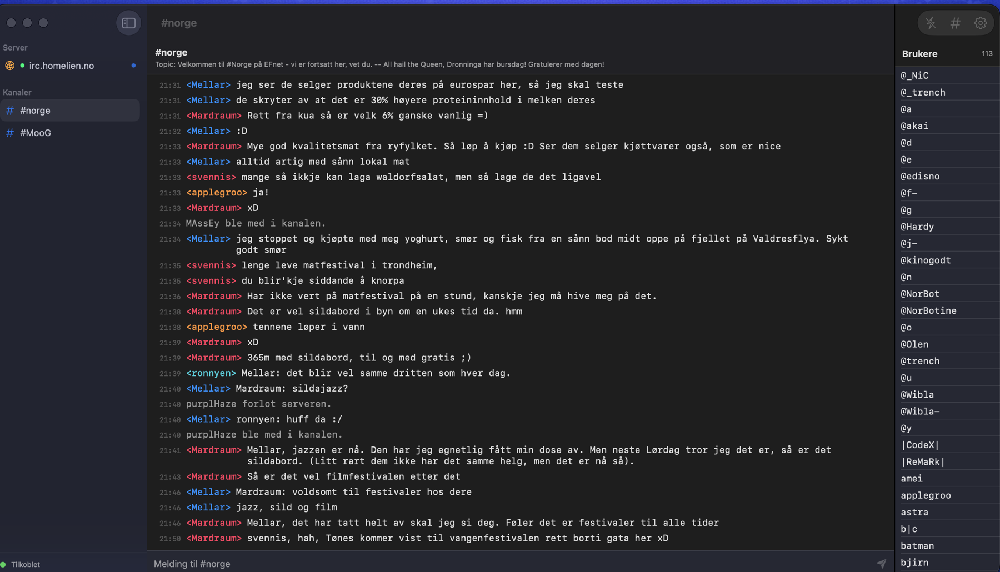
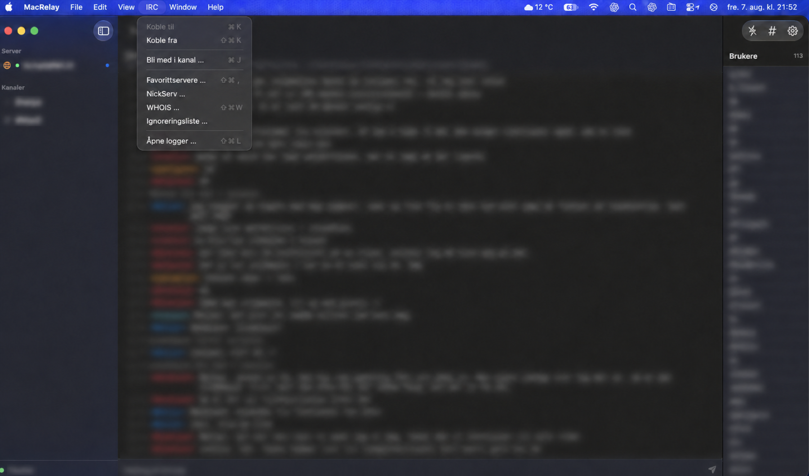
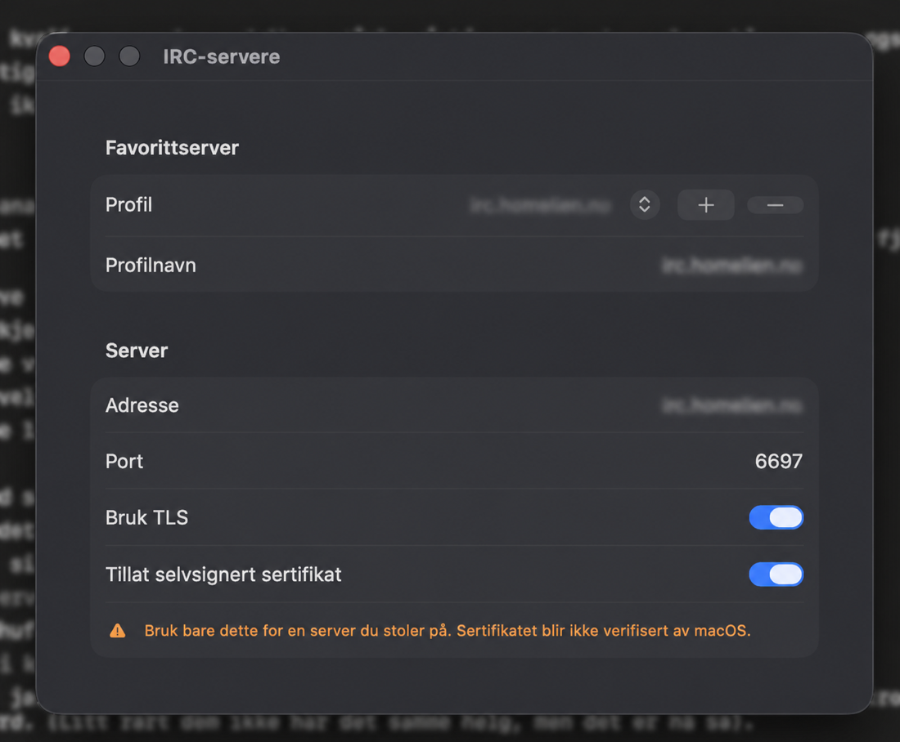
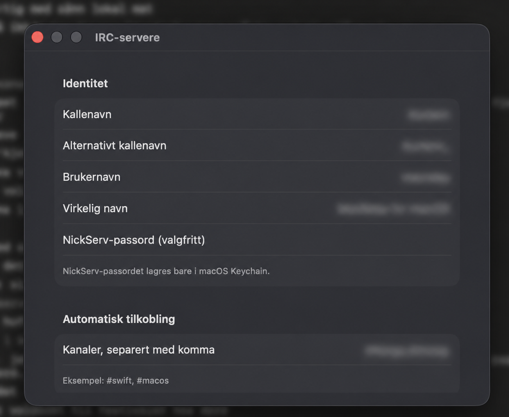
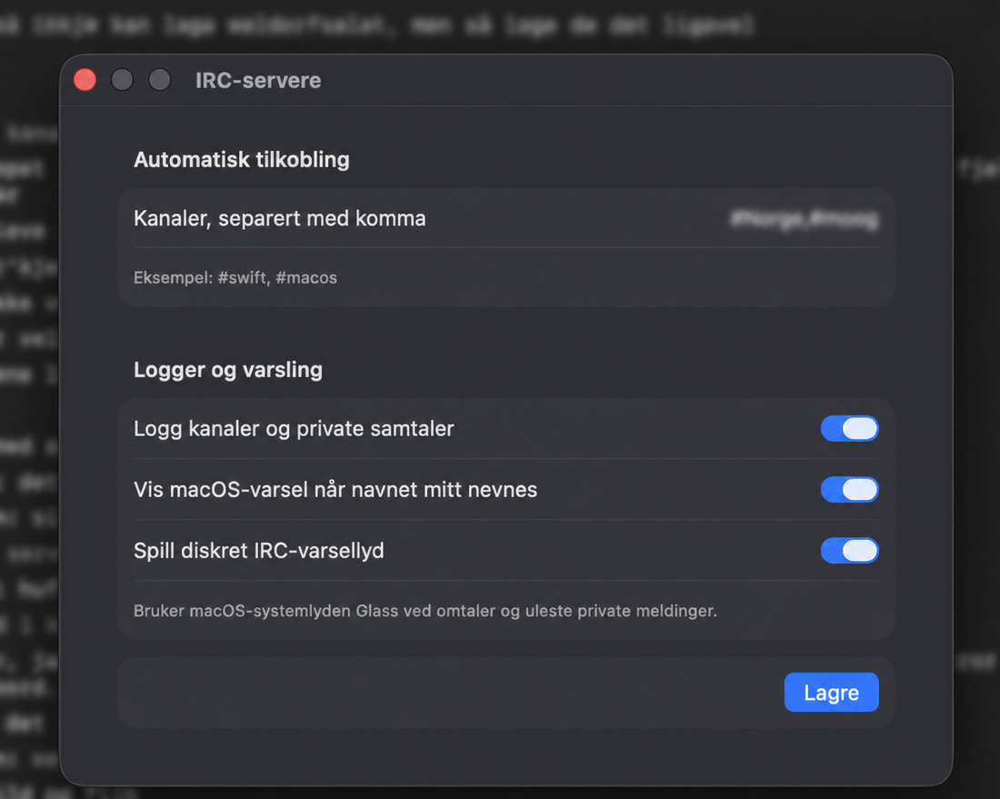

# MacRelay

MacRelay er en klassisk IRC-klient for macOS, bygget i Swift og SwiftUI.

Målet er en enkel, rask og helt native Mac-opplevelse som gjenskaper følelsen av tradisjonelle IRC-klienter – uten et Discord-lignende grensesnitt eller tunge rammeverk.

MacRelay fokuserer på moderne IRCv3-støtte, sømløs ZNC-integrasjon og en klient som føles hjemme på macOS.

**Versjon 1.1 · build 2**

[Last ned MacRelay som DMG](dist/MacRelay.dmg)

> **Testversjon**
>
> Den vedlagte appen er ikke notarized av Apple. macOS kan derfor be deg bekrefte åpning av appen. Last bare ned og åpne programmet dersom du stoler på denne kildekoden og utgiveren.



---

# Hvorfor MacRelay?

MacRelay er laget for brukere som ønsker en moderne, native IRC-klient uten å gi slipp på den klassiske IRC-opplevelsen.

Fokus er på:

- Native SwiftUI-grensesnitt
- Moderne IRCv3-støtte
- Sømløs ZNC-integrasjon
- Lokal historikk og logging
- Rask oppstart
- Ingen Electron
- Ingen abonnement
- Bygget eksklusivt for macOS

---

# Nøkkelfunksjoner

- IRC over vanlig TCP eller TLS
- Favorittservere og flere serverprofiler
- Automatisk tilkobling og kanal-join
- IRC PASS for ZNC og passordbeskyttede IRC-servere (lagret i macOS Keychain)
- Automatisk ZNC-gjenkjenning
- Automatisk IRCv3 capability-forhandling
- ZNC-playback med nøyaktig `server-time`
- Automatisk deduplisering av replayede meldinger
- Sømløs bruk av flere MacRelay-klienter mot samme ZNC-instans
- Robust reconnect etter macOS-dvale og midlertidige nettverksbrudd
- Automatisk Away basert på systemets inaktivitetstid
- Fast Away ved tilkobling (valgfritt)
- Alternativt nick
- Separat NickServ-passord lagret i macOS Keychain
- Kanal-topic
- Klassisk brukerstatus (`@`, `%`, `+`)
- Sortert brukerliste
- Private samtaler
- WHOIS
- Ignoreringsliste
- Diskré markering av uleste meldinger og omtaler
- Valgfri native menylinjemodus med tilkoblingsstatus og uleste samtaler
- Valgfritt skjult Dock-ikon, kjøring etter lukket hovedvindu og oppstart ved innlogging
- Native macOS-varsler
- Valgfri IRC-varsellyd
- Lokal UTF-8-logging av kanaler og private samtaler
- Lokal kanalhistorikk
- Diskrete markeringer for ny økt og reconnect
- Automatisk gjenoppretting av:
  - server
  - åpne kanaler
  - private samtaler
  - aktiv samtale
- Registrering av innkommende DCC SEND-tilbud

---

# Installere testversjonen

1. Last ned [`MacRelay.dmg`](dist/MacRelay.dmg)
2. Åpne DMG-filen.
3. Dra **MacRelay** til **Programmer / Applications**.
4. Start MacRelay fra Programmer-mappen.

Hvis Gatekeeper blokkerer første oppstart, kan du:

- høyreklikke på MacRelay og velge **Åpne**
- eller godkjenne appen under:

**Systeminnstillinger → Personvern og sikkerhet**

### SHA-256

```text
8d8eb1058fd3f90b63fa9a04c6f0d41f002be40737508e904733de8a784c5987
```

---

# ZNC

MacRelay har innebygget støtte for ZNC.

Bruk feltet **IRC PASS (valgfritt)** med formatet:

```text
bruker/nettverk:passord
```

IRC PASS og NickServ-passord lagres separat i macOS Keychain.

MacRelay oppdager ZNC automatisk gjennom dokumenterte IRCv3-capabilities.

Ingen egen «ZNC-modus» trenger å aktiveres.

Når ZNC tilbyr relevante capabilities aktiveres automatisk:

- `server-time`
- `echo-message`
- `znc.in/self-message`

Dette gir:

- korrekte tidsstempler på playback
- deduplisering av meldinger
- egne meldinger sendt fra andre MacRelay-klienter
- sømløs bruk av flere Mac-er

For å bruke flere MacRelay-installasjoner samtidig må ZNC-brukeren ha **MultiClients** aktivert.

Da kan flere Mac-er dele den samme IRC-tilkoblingen uten å ende opp med alternativt nick.

MacRelay kobler kun klientvinduet fra. Selve IRC-økten holdes levende av ZNC.

---

# Skjermbilder

## Kanalvisning


## Native IRC-meny



## Server og identitet

| Server | Identitet |
| --- | --- |
|  |  |

## Logging og varsling



---

# Bygge fra kildekode

1. Klon repoet.
2. Åpne `MacRelay.xcodeproj` i Xcode.
3. Velg **MacRelay**-scheme.
4. Velg **My Mac**.
5. Bygg og kjør med:

```text
⌘R
```

Krever macOS 14 eller nyere.

Prosjektet bygger som Universal Binary når både Apple Silicon og Intel er valgt i Xcode.

---

# IRC-kommandoer

MacRelay støtter blant annet:

```text
/join #kanal
/part [melding]
/msg nick melding
/query nick
/me handling
/nick nyttnick
/whois nick
/ignore nick
/unignore nick
/quote RAW IRC-LINJE
/quit [melding]
```

---

# Logger

Logger lagres lokalt under:

```text
~/Library/Application Support/MacRelay/Logs/
```

---

# Kjente begrensninger

- DCC SEND-tilbud oppdages og vises, men direkte filoverføring er foreløpig ikke implementert.
- Én aktiv IRC-server om gangen. Flere serverprofiler støttes, men bare én servertilkobling kan være aktiv samtidig.
- Distribusjonsbygget i `dist/` er ment for testing og er ikke notarized av Apple.

---

# Lisens

Dette prosjektet er publisert som åpen kildekode. Se prosjektets lisensfil for detaljer.
